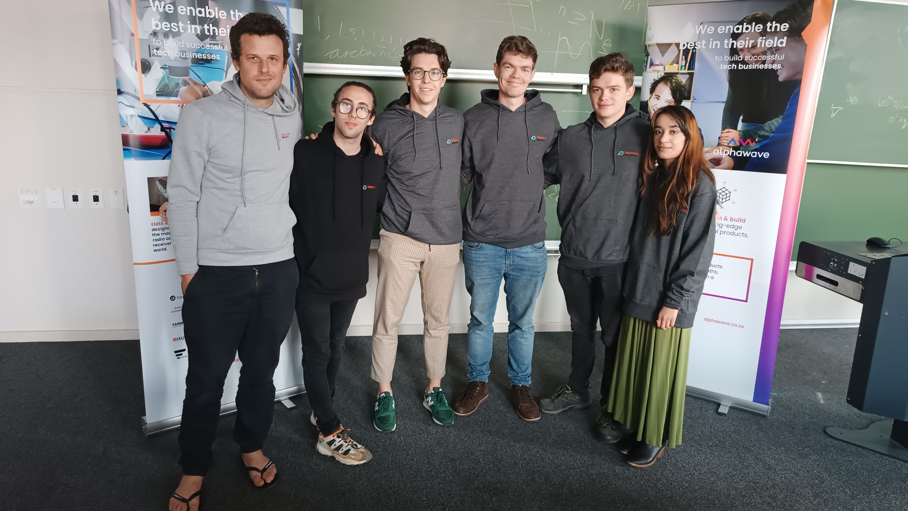

# Predictive-Insights-hackathon

Hi! Welcome to our Predictive Insights hackathon submission. 



[link](#test)

### Team Not_Ols:

    - Gareth Warbutron
    - Richard Taylor
    - Jeremy Simpson 

The objective of this challenge is to build a machine learning model that predicts youth employment, based on data from labour market surveys in South Africa. Youth unemployment and under-employment is a major concern for any developing country, and serves as an important predictor of economic health and prosperity. Being able to predict, and understand, which young people will find employment and which ones will require additional help, helps promote evidence-based decision-making, supports economic empowerment, and allows young people to thrive in their chosen careers.

### File structure:

- 1_Code:     Contains all code for submission, check out the Old Code directory for our many previous attempts
- 2_Docs:     Contains Docs from Zindi and our teams' CVs
- 3_Data:     Contains test and train data
- 4_Outputs:  Outputs from out models, ready for submission

### Usage:

To run our submission, do the following: 

Install requirements:
```
    pip install -r requirements.txt
```

Followed by:
```
erfgr
```
This firstly runs the data processor, which runs


> test
>
> this is ==important== :joy:
>


term
 : defintion

#test