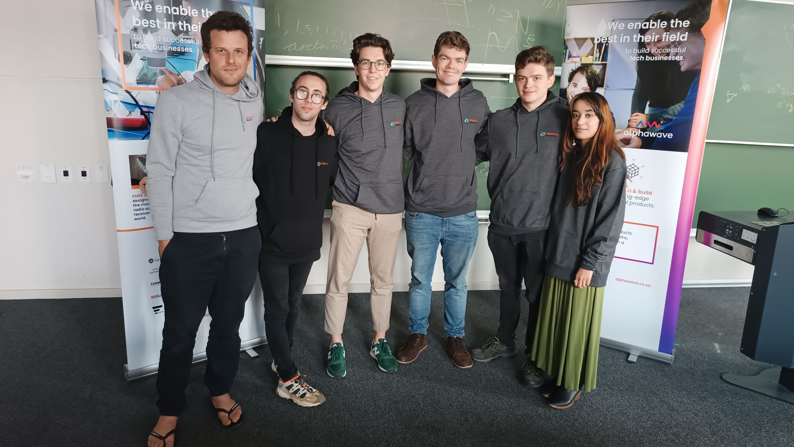

# Predictive-Insights-hackathon

***

Hi! :smile: 

Welcome to our Predictive Insights hackathon submission. We are proud to announce this submission as the :boom: **winning submission** :boom: on [Zindi](https://zindi.africa/competitions/predictive-insights-youth-income-prediction-challenge).



### Contents:

  1. Overview
  2. File Structure
  3. Usage
  4. Report
    a. Introduction
    b. Descriptive Analysis & Data Cleaning
    c. ect...
    

### Team Not_Ols:

 - Gareth Warbutron
 - Richard Taylor
 - Jeremy Simpson 
 - Zuileigha Patel

### Objective

*To build a machine learning model that predicts youth employment, based on data from labour market surveys in South Africa. Youth unemployment and under-employment is a major concern for any developing country, and serves as an important predictor of economic health and prosperity. Being able to predict, and understand, which young people will find employment and which ones will require additional help, helps promote evidence-based decision-making, supports economic empowerment, and allows young people to thrive in their chosen careers.*

### File structure:

 - `1_Code`:     Contains all code for submission, check out the `Old Code` directory for our many previous attempts
 - `2_Docs`:     Contains Docs from Zindi and our teams' CVs
 - `3_Data`:     Contains test and train data
 - `4_Outputs`:  Outputs from out models, ready for submission

### Usage:

To run our submission, do the following: 

#### Install requirements:
```bash
    pip install -r requirements.txt
```
#### To run:

 run  `run.py`

#### Alternatively:
```bash
    python ./1_Code/processor.py
```
This runs the data processor. And creates `processed_test.csv` and `processed_train.csv`

And then run:
```bash
    python ./1_Code/stacking.py
```
This runs a optimized combination of all our best models and outputs `stacked.csv`

***

# Report

> Using a Machine Learning Procedure to predict the probability a young person is unemployed

### Introduction

South Africa’s labour market is characterised by high unemployment. In particular, the country is plagued with high youth unemployment, with the unemployment rate of people under 35 being x%. Factors such as the country’s poor education system contribute to this unemployment situation. Because of poor basic education, people are unable to acquire the skills needed to succeed in the labour market, given the jobs that are on offer. However, there are a multitude of other factors that affect this. As such we utilise a machine learning approach in order to predict the probability that a person will be unemployed in 6 months, taken from a pooled cross-sectional dataset. This type of method has numerous applications in reducing the youth unemployment rate. In particular, it could be useful for the design and evaluation of Government-led employment initiatives by providing a solid way to identify which people to target with certain policies. 

### Descriptive Analysis & Data Cleaning

Data Cleaning & 
The data we utilise has a pooled cross-sectional structure including different socio-economic outcomes in a specific round of the survey. It includes the current employment status and various information about geography and education. The data is split up into test and training data – where the training data has our target variable (an unemployment dummy for 6 months’ time). For the purposes of this section, we explore relationships between the target variable and other variables using the training data set.
Table 1 summarises how we cleaned a number of the variables. Table 2 reflects the data transformations we made. A number of binary independent variables were also used in order to capture qualitative aspects of the data. Finally, Table 3 presents the interactions we used in our analysis. The interactions x, y and z were motivated by the heterogeneity of the labour market in different locations around South Africa. The interactions between gender were motivated by the existence of gender barriers in the South African labour market. Finally, the interactions between age and tenure were useful because they took into account any non-linearities that there might be between these variables and the probability of unemployment.
Descriptive
In the context of the South African Labour Market, multiple past studies have explored the link between educational attainment and the likelihood of being unemployed. Running a linear probability model of the target on having a matric and tertiary education and math mark are both significant, we see that educational attainment has an effect on the probability of unemployment in the next round. 

Talk about the correlation relationship between target and math level
Talk about current employment status and target - how much is the current employment status associated with the target (look at the correlation of each of the groups in employment status and use this to highlight the different levels of association)
Talk about the relationship between province and location with:
Current employment status (here we use both test and training)
The target

Additionally, we see that age and tenure both have an effect on the probability of being unemployed, using an LPM model. Additionally, we see that there is a non-linearity in the effect of these variables by looking at the localised polynomial regression graphs presented in Figures 1 & 2. 
Finally, we notice that the proportion of our training sample who are unemployed varies by round indicating that the Round might play an important role in determining whether or not someone is employed.
Model Specification
Variable Selection Methods
Why are these important and useful
What type of selection tools did we use
Machine Learning Methods
Talk about current method (what are the main features)
Why we liked this best
What were our alternatives 
Code Architecture 
Results
Cross-validation Techniques
In order to assess the model, we use the following cross-validation techniques.
Table with cross-validation scores of different models
Brief discussion of these results


| Model | Key Features | ROC-AUC |
|---------|---------|---------|
|  | | |
| | | |
| | | |

| Header1 | Header2 | Header3 |
| ------- | ------- | ------- |
| cell1   | cell2   | cell3   |
| cell4   | cell5   | cell6   |

Key insights about the best models
Finish off discussion

