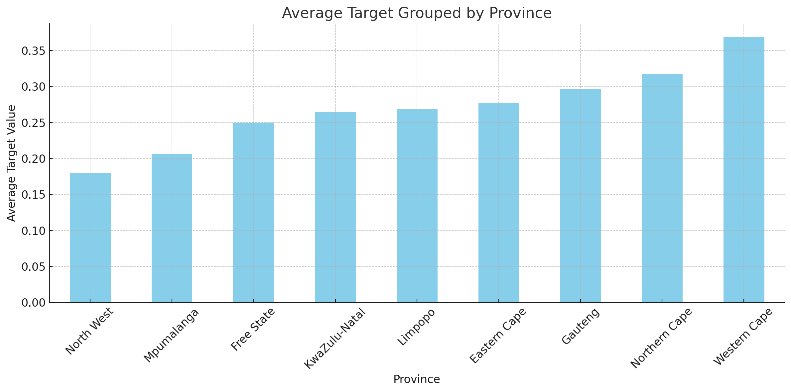
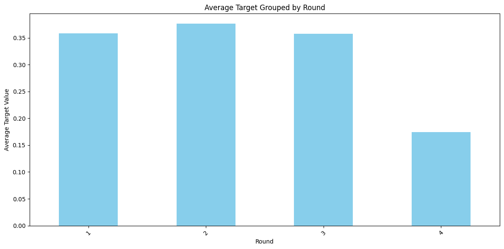

# Predictive Insights hackathon

***

Hi! :smile: 

Welcome to our Predictive Insights hackathon submission. We are proud to announce this submission as the :boom: **winning submission** :boom: on [Zindi](https://zindi.africa/competitions/predictive-insights-youth-income-prediction-challenge).


# Overview:

### Contents:

  1. Overview
  2. File Structure
  3. Usage
  4. Report

***  

### Team Not_Ols:

 - Gareth Warbutron
 - Richard Taylor
 - Jeremy Simpson 
 - Zuileigha Patel

### Objective:

*To build a machine learning model that predicts youth employment, based on data from labour market surveys in South Africa. Youth unemployment and under-employment is a major concern for any developing country, and serves as an important predictor of economic health and prosperity. Being able to predict, and understand, which young people will find employment and which ones will require additional help, helps promote evidence-based decision-making, supports economic empowerment, and allows young people to thrive in their chosen careers.* 

### File structure:

 - `1_Code`:     Contains all code for submission, check out the `Old Code` directory for our many previous attempts
 - `2_Docs`:     Contains Docs from Zindi and our teams' CVs
 - `3_Data`:     Contains test and train data
 - `4_Outputs`:  Outputs from out models, ready for submission

### Usage:

To run our submission, do the following: 

#### Install requirements:
```bash
    pip install -r requirements.txt
```
#### To run:

```bash
    python run.py
```
This will create the output `stacked.csv`
#### Alternatively:
```bash
    python ./1_Code/processor.py
```
This runs the data processor. And creates `processed_test.csv` and `processed_train.csv`

And then run:
```bash
    python ./1_Code/stacking.py
```
This runs a optimized combination of all our best models and outputs `stacked.csv`

***

# Report

> Using a Machine Learning Procedure to predict the probability a young person is unemployed

### Introduction

South Africa’s labour market is characterised by high unemployment. In particular, the country is plagued with high youth unemployment, with the unemployment rate of people under 35 being x%. Factors such as the country’s poor education system contribute to this unemployment situation. Because of poor basic education, people are unable to acquire the skills needed to succeed in the labour market, given the jobs that are on offer. However, there are a multitude of other factors that affect this. As such we utilise a machine learning approach in order to predict the probability that a person will be unemployed in 6 months, taken from a pooled cross-sectional dataset. This type of method has numerous applications in reducing the youth unemployment rate. In particular, it could be useful for the design and evaluation of Government-led employment initiatives by providing a solid way to identify which people to target with certain policies. 

### Descriptive Analysis & Data Cleaning

#### Data & Processing:

The data we utilise has a pooled cross-sectional structure including different socio-economic outcomes in a specific round of the survey. It includes the current employment status and various information about geography and education. The data is split up into test and training data – where the training data has our target variable (an unemployment dummy for 6 months’ time). For the purposes of this section, we explore relationships between the target variable and other variables using the training data set.

*Pre-processing and feature engineering methods used* summarises how we cleaned a number of the variables and reflects the data transformations we made. A number of binary independent variables were also used in order to capture qualitative aspects of the data. *Pre-processing and feature engineering methods used* also presents the interactions we used in our analysis. The interactions x, y and z were motivated by the heterogeneity of the labour market in different locations around South Africa. The interactions between gender were motivated by the existence of gender barriers in the South African labour market. Finally, the interactions between age and tenure were useful because they took into account any non-linearities that there might be between these variables and the probability of unemployment.


### Pre-processing and feature engineering methods used

| **Step**                          | **Description**                                                                                                                                                                         |
|----------------------------------|----------------------------------------------------------------------------------------------------------------------------------------------------------------------------------------|
| Convert "Survey_date" to datetime| Extract year, month, and day features from "Survey_date" and drop the original column.                                                                                                   |
| Create Interaction Terms         | Create interactions between various columns, e.g., "Geography" & "Status", "Status" & "Tenure", etc.                                                                                     |
| Calculate Age-related Features   | Calculate "Age", "is_young_adult", "is_middle_aged", "is_senior", and "Age_first_employment".                                                                                            |
| Transform Percentage Columns     | Convert percentage range columns (like "Math", "Mathlit", etc.) to numerical values using a mapping.                                                                                     |
| Impute Maths Combined            | Combine values from "Math" and "Mathlit" to create a new "Maths_combined" column.                                                                                                        |
| Subjects Passed                  | Count the number of subjects passed based on certain criteria.                                                                                                                          |
| Education Quality                | Assign quality of education based on "Matric" and "Schoolquintile" columns.                                                                                                             |
| School & Education Interactions  | Interactions between subjects and "Schoolquintile".                                                                                                                                     |
| Downturn Feature                 | Create a binary feature "downturn" based on values in the "Round" column.                                                                                                               |
| Map Status                       | Map "unemployed" status to -1, and all other statuses to 1.                                                                                                                             |
| Modify Tenure                    | Modify "Tenure" based on "Status" and create additional "Tenure_Status" and "Tenure^2_Status" columns.                                                                                   |
| Calculate Exposure               | Calculate exposure based on subjects and increase by 10 if they have a degree.                                                                                                          |
| One-Hot Encoding                 | Encode categorical columns ("Status", "Geography", "Province") using one-hot encoding.                                                                                                  |
| Handle Missing Values            | For numerical columns, fill missing values with the minimum. For categorical columns, fill missing values with the mode.                                                                |
| Feature Selection                | Drop features using an ElasticNet model.                                                                                                                                               |

This table provides an organized summary of the various pre-processing and feature engineering steps used in the provided script.

### Descriptive Analysis

In the context of the South African Labour Market, there is a well established link between educational attainment and the likelihood of being unemployed. We run a linear probability model of the target on both the matric and tertiary education dummy variables as well as math mark. Both matric and degree had a statistically significant effect on the probability of unemployment in the next round. Math mark was not statistically significant. 

Economic status vastly affects the rate of unemployment in a province, as depicted in the Figure below. The employment rate of the different provinces are hugely affected by their economic status. Gauteng has the best performing economy compared to the other provinces in South Africa. Western Cape generally has a very high employment rate compared to the other provinces in South Africa. Provinces such as Eastern Cape and Limpopo have a very low performing economy. These observations correlate with the data given in the test data and train data as the employment status of participants in Western Cape and Gauteng are better than those in other provinces.
Finally, we notice that the proportion of our training sample who are unemployed varies by round indicating that the Round might play an important role in determining whether or not someone is employed.




### Model Specification
####  Variable Selection Methods

Variable selection methods allow us to abstract away from making choices about which variables have the most predictive power. In this model we use the elastic net variable selection technique - a regulatisation technique. This combines the Lasso and Ridge regularisation techniques, both of which are used to control sparsity in the model. This feature is particularly useful when we have high-dimensional datasets where many features are irrelevant or redundant. It also prevents multicollinearity. In this case, the categorical nature of the data means that we feed a lot of data into the model if we include interactions between any of these categorical variables. This means our data set likely has a large number of of irrelevant variables and elastic net gives us an ideal method to decide which of these are important and which are not. We found that including this feature significantly improved our results. 

#### Machine Learning Methods

Our model is a stacked classifier model, a type of ensemble model that runs the processed data through a series base-learners which output a series of predictions. We then combine these predictions with the target variable and feed this in to a Neural Net (a Multilayer Perceptron) to determine the best weighting of the different models in order to  The base learning models in this case are XG Boost, Ada Boost, Bernoulli Naive Bayes model, Gaussian Naive Bayes model as well as K Nearest Negihbours model (KNN). Initially, we included a random forest, however, this is quite similar to XG boost and so in our testing it was highly correlated. This caused problems with our model’s accuracy.

Other methodologies we attempted included a logistic regression model and another type of ensemble model, called a voting classifier model. However these performed less effectively than the Stacked Classifier model. 


### Cross-validation Techniques

In order to assess the model, we use the Receiver Operating Characteristic Area Under Curve (ROC-AUC) score.  Our cross validation methodology was based off a Stratified K-fold, which is used to segment the data into K equally sized subsets. This then trains and tests the data K mes on different subsets of the data. The data is also stratified such that each fold maintains similar proportions of the target class. This was then used to evaluate our models performance by seeing which model resulted in the highest ROC-AUC score. Importantly,however, since the models are affected by randomness, re-running the same model typically a similar,  but not not identical evaluation metric. However, despite this randomness the Stacked Classifier was consistently the best model, outperforming the standalone base models (Xgboost, ada_boost, KNN, and Bernoulli Naive Bayes model) the other ensemble models that utilised a voting mechanism. 

### Key model insights:

In order to assess the model, we use the Receiver Operating Characteristic Area Under Curve (ROC-AUC) score.  Our cross validation methodology was based off a Stratified K-fold, which is used to segment the data into K equally sized subsets. This then trains and tests the data K mes on different subsets of the data. The data is also stratified such that each fold maintains similar proportions of the target class. This was then used to evaluate our models performance by seeing which model resulted in the highest ROC-AUC score. Importantly,however, since the models are affected by randomness, re-running the same model typically a similar,  but not not identical evaluation metric. In order to deal with the randomness we ran the model multiple times and then used a geometric mean in order to combine the different models. However, despite this randomness the Stacked Classifier was consistently the best model, outperforming the standalone base models (Xgboost, ada_boost, KNN, and Bernoulli Naive Bayes model) the other ensemble models that utilised a voting mechanism. 

#### Model Similarity (Pearson Correlation Coefficients):
|               | xgb      | naive_bayes | BernoulliNB | knn      | ada_boost |
|---------------|----------|-------------|-------------|----------|-----------|
| xgb          | 1.000000 | 0.563276    | 0.581883    | 0.610109 | 0.526448  |
| naive_bayes  | 0.563276 | 1.000000    | 0.609602    | 0.622079 | 0.409346  |
| BernoulliNB  | 0.581883 | 0.609602    | 1.000000    | 0.572590 | 0.390128  |
| knn          | 0.610109 | 0.622079    | 0.572590    | 1.000000 | 0.340631  |
| ada_boost    | 0.526448 | 0.409346    | 0.390128    | 0.340631 | 1.000000  |

#### Model Performance Metrics (averaged over k-folds):
| Model       | AUC-ROC  | Accuracy | Precision | Recall   | F1 Score |
|-------------|----------|----------|-----------|----------|----------|
| BernoulliNB | 0.737343 | 0.691045 | 0.451567  | 0.618458 | 0.521220 |
| ada_boost   | 0.828589 | 0.812189 | 0.780649  | 0.432759 | 0.555863 |
| knn         | 0.817464 | 0.793035 | 0.679110  | 0.453806 | 0.543964 |
| naive_bayes | 0.709926 | 0.774378 | 0.663849  | 0.348569 | 0.456384 |
| xgb         | 0.867982 | 0.817662 | 0.890590  | 0.376025 | 0.527583 |


Obviously no coding project is ever finished, and we still think there is more room for improvement (perhaps even to reach state of the art!), however we are proud of what we did given the time constraints.  

### Thank you for reading! :heart:

